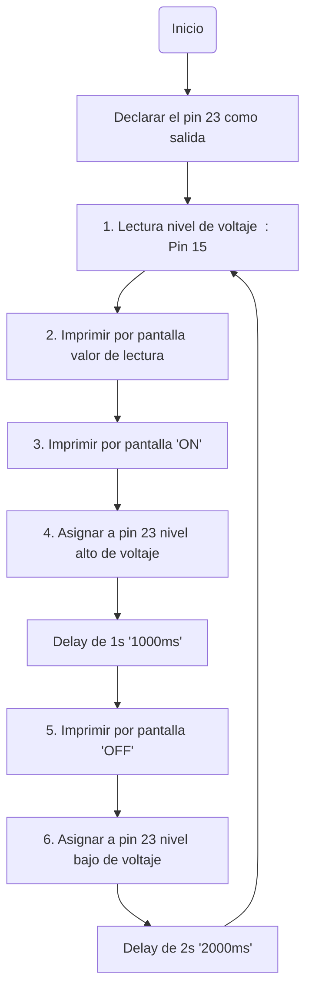
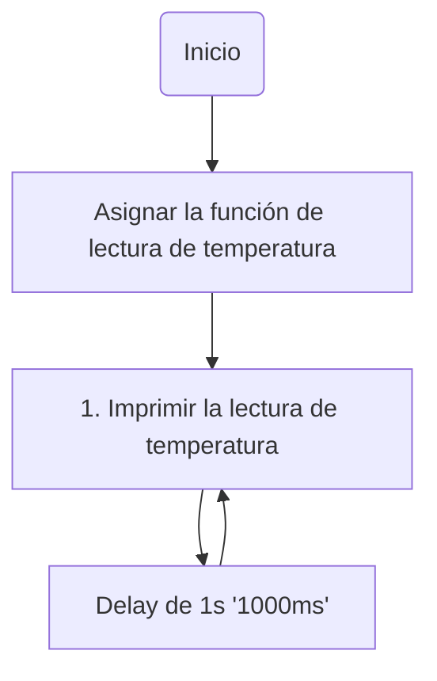

# Práctica 1 - Blink #
## Yago Carballo Barroso y Ramon Llobet Duch
En esta práctica produciremos un parpadeo periodico de un led y se utilizará la salida serie para depurar el programa.
### **Código** ###
```ino
#include <Arduino.h>

const int potPin = 15; //Pin al que conectaremos el voltaje
int potValue = 0; //Variable donde se almacenaran los valores de voltaje
float measurement = 0; //Variable donde se almacenaran los valores de temperatura

void setup() {

  Serial.begin(115200);

  pinMode(23, OUTPUT); //Declararamos el pin 23 como salida (LED)

}

void loop() {

  potValue=analogRead(potPin); //Lectura del valor analógico del punto 15 (Voltaje)
  Serial.println(potValue); //Escritura del valor obtenido antes

  
  Serial.println("ON"); //Imprimimos por pantalla "ON"
  digitalWrite(23,HIGH); //Asignamos un valor alto de voltaje al pin 23 (LED)
  delay(1000); //Esperamos 1s

  Serial.println("OFF"); //Imprimimos por pantalla "OFF"
  digitalWrite(23,LOW); //Asignamos un valor bajo de voltaje (apagado) al pin 23 (LED)
  delay(2000); //Esperamos 2s

}
```

### **Diagrama de flujo** ###



### **Diagrama de tiempos** ###
**Nota:** Como no sabemos cuantos ciclos de reloj hay en un segundo, intuimos que pasan más ciclos de los que visualmente se ven. (ipp=Imprimir por pantalla)
```wavedrom
{ signal : [
  { name: "actions",  wave: "45537..537....",   data: "1 2 3 4 delay:1s 5 6 delay:2s" },
  {name: "led", wave: "0...1....0...."},
  {name: "ipp", wave: "01.0...10....."},
  {name: "lectura", wave: "10............"},
]}
```
# Ejercicio voluntario - Temperatura #
En esta parte el objetivo es leer el valor del sensor de temperatura interno y sacarlo por el puerto serie.
### **Código** ###

```ino
#include <Arduino.h>

float measurement = 0; //Variable donde se almacenará los valores de temperatura

void setup() {

  Serial.begin(115200); //Inicializamos el puerto serie
  measurement = temperatureRead(); //Llamamos a la función que lee la temperatura

}

void loop() {
  
  Serial.print("Hall sensor measurement: ");
  Serial.println(measurement); //Imprimimos por pantalla el valor de la temperatura

  delay(1000);

}
```

### **Diagrama de flujo** ###



### **Diagrama de tiempos** ###
**Nota:** ipp=Imprimir por pantalla.
```wavedrom
{ signal : [
  {name: "accion", wave: "57575757", data: "1 delay 1 delay 1 delay 1 delay"},
  {name: "ipp", wave: "10101010"},
  {name: "lectura", wave: "1......."},
]}
```
