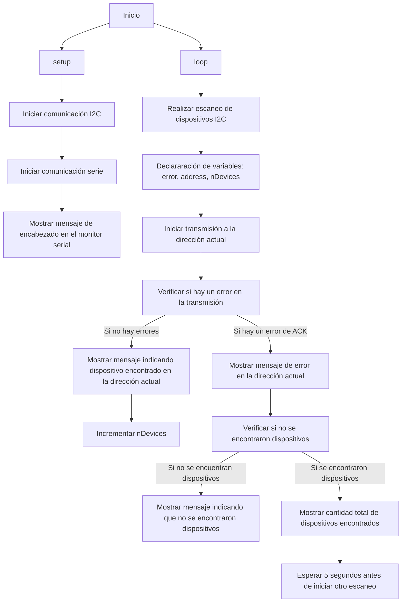
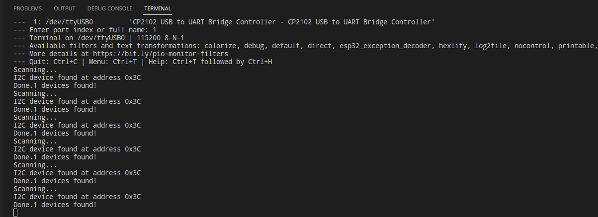
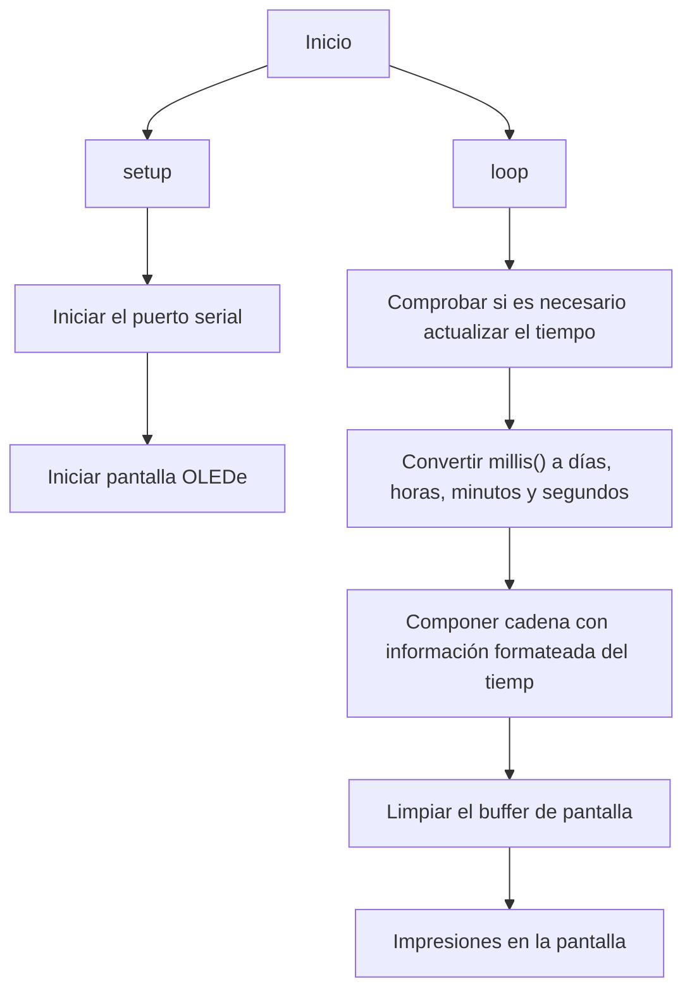
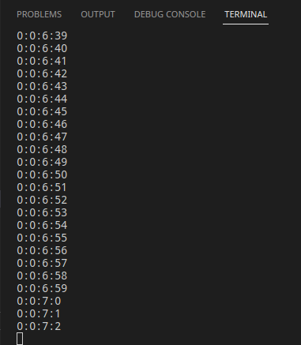
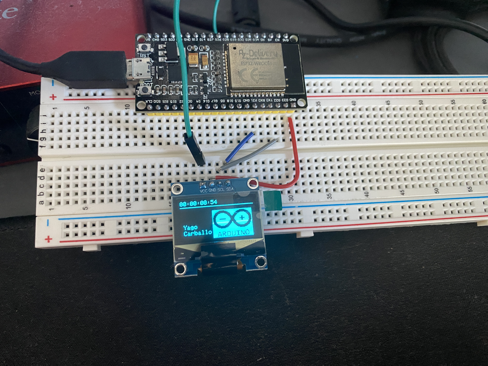

# Informe - Práctica 5 - Protocolo I2C
En esta práctica vamos a trabajar con el protocolo I2C. 

Colocaremos varios dispositivos I2C al ESP32 (escáner y Display OLED I2C).
En la primera parte de la práctica tenemos el código que nos servirá para escanear los dispositivos I2C conectados al ESP32 y muestrará la información correspondiente en el monitor serial. 
De esta manera podremos identificar los dispositivos I2C disponibles en el bus y sus direcciones correspondientes.
***
## Escáner de dispositivos I2C
El escáner I2C es una herramienta utilizada para idetificar dispositivos conectados a un bus I2C de la ESP32.
En primer lugar, el escáner I2C realizará la inicialización del bus I2C (configurará las líneas SDA y SCL).
A continuación, hará un escaneo de direcciones.
Finalmente, hará un registro de los dispositivos encontrados y sus direcciones.
***
### Código de Escáner
```cpp
//Declaración de las bibliotecas:
#include <Arduino.h> //ésta biblioteca es necesaria par el funcionamiento básico de Arduino.
#include <Wire.h>//ésta biblioteca se utiliza para la comunicación I2C
 
void setup() {
  //Se inicia la comunicación I2C:
  Wire.begin();
  Serial.begin(115200);//Se inicia la comunicación serie a una velocidad de 115200 baudios
  Serial.println("\nI2C Scanner");//Se muestra un mensaje de encabezado en el monitor serial
}
 
void loop() {
  //Aquí se realiza el escaneo de  dispositivos I2C
  byte error, address;
  int nDevices;
  Serial.println("Scanning...");
  nDevices = 0;
  for(address = 1; address < 127; address++ ) {
  //Se itera a través de las direcciones de 1 a 127 y 
  //se intenta establecer comunicación con cada dirección
    Wire.beginTransmission(address);//se verifica si hay un error en la transmisión
    error = Wire.endTransmission();
    if (error == 0) { //Si no hay errores, se muestra un mensaje indicando que se encontró un dispositivo I2C en la dirección especificada. La dirección se muestra en hexadecimal.
      Serial.print("I2C device found at address 0x");
      if (address<16) {
        Serial.print("0");
      }
      Serial.println(address,HEX);
      nDevices++;
    }
    else if (error==4) { // El valor de estado 4 significa que no se recibió ACK (Acknowledge) del dispositivo esclavo después de enviar la dirección de registro o de memoria.
      Serial.print("Unknow error at address 0x");
      if (address<16) {
        Serial.print("0");
      }
      Serial.println(address,HEX);
    }    
  }
  if (nDevices == 0) {// Si no se encuentran dispositivos I2C (nDevices == 0), se muestra un mensaje indicando que no se encontraron dispositivos.
    Serial.println("No I2C devices found\n");
  }
  else {// Si se encuentran dispositivos I2C, se muestra la cantidad total de dispositivos encontrados.
    
    Serial.print("Done. ");
    Serial.print(nDevices,2);
    Serial.print(" devices found!\n");
  }
  delay(5000);//se espera un período de 5 segundos antes de iniciar otro escaneo.          
}
```

### Diagrama de flujo


***

### Salida de cógido del Escáner

<center></center>
***

## Diplay OLED I2C

***
### Código del Display OLED
```cpp
#include <Arduino.h>
#include <Wire.h>
#include <Adafruit_SSD1306.h>//para controlar una pantalla OLED
 
// Definir constantes. Se definen constantes para el ancho y alto de la pantalla OLED.
#define ANCHO_PANTALLA 128 // ancho pantalla OLED
#define ALTO_PANTALLA 64 // alto pantalla OLED
 
// Objeto de la clase Adafruit_SSD1306
Adafruit_SSD1306 display(ANCHO_PANTALLA, ALTO_PANTALLA, &Wire, -1);//Se crea un objeto de la clase llamado display que representa la pantalla OLED:
 
//Imagen
static const unsigned char PROGMEM datos_imagen[414] = {
//matriz de datos de imagen en formato de memoria flash (PROGMEM). 
//Esta matriz representa una imagen que se mostrará en la pantalla OLED
    0xff, 0xff, 0xff, 0xff, 0xff, 0xff, 0xff, 0xff, 0xf8, 
    0xff, 0xf0, 0x03, 0xff, 0xff, 0xfe, 0x00, 0x7f, 0xf8, 
    0xff, 0xc0, 0x00, 0x7f, 0xff, 0xf0, 0x00, 0x1f, 0xf8, 
    0xff, 0x00, 0x00, 0x1f, 0xff, 0xc0, 0x00, 0x07, 0xf8, 
    0xfc, 0x00, 0x00, 0x0f, 0xff, 0x80, 0x00, 0x01, 0xf8, 
    0xf8, 0x00, 0x00, 0x03, 0xff, 0x00, 0x00, 0x00, 0xf8, 
    0xf0, 0x03, 0xf8, 0x01, 0xfc, 0x00, 0xff, 0x00, 0x78, 
    0xf0, 0x1f, 0xfe, 0x00, 0xfc, 0x03, 0xff, 0xc0, 0x38, 
    0xe0, 0x3f, 0xff, 0x80, 0xf8, 0x0f, 0xff, 0xe0, 0x38, 
    0xc0, 0x7f, 0xff, 0xc0, 0x70, 0x1f, 0xff, 0xf0, 0x18, 
    0xc0, 0xff, 0xff, 0xe0, 0x20, 0x3f, 0xff, 0xf8, 0x18, 
    0xc1, 0xff, 0xff, 0xf0, 0x00, 0x7f, 0xff, 0xfc, 0x08, 
    0x81, 0xff, 0xff, 0xf8, 0x00, 0xff, 0xc7, 0xfc, 0x08, 
    0x83, 0xff, 0xff, 0xfc, 0x01, 0xff, 0xc7, 0xfe, 0x08, 
    0x83, 0xff, 0xff, 0xfc, 0x01, 0xff, 0xc7, 0xfe, 0x08, 
    0x83, 0xf0, 0x01, 0xfe, 0x03, 0xfe, 0x00, 0xfe, 0x08, 
    0x83, 0xf0, 0x01, 0xfe, 0x03, 0xfe, 0x00, 0xfe, 0x08, 
    0x83, 0xff, 0xff, 0xfe, 0x01, 0xff, 0xc7, 0xfe, 0x08, 
    0x83, 0xff, 0xff, 0xfc, 0x01, 0xff, 0xc7, 0xfe, 0x08, 
    0x83, 0xff, 0xff, 0xf8, 0x00, 0xff, 0xc7, 0xfe, 0x08, 
    0x81, 0xff, 0xff, 0xf8, 0x00, 0x7f, 0xff, 0xfc, 0x08, 
    0xc1, 0xff, 0xff, 0xf0, 0x20, 0x7f, 0xff, 0xfc, 0x18, 
    0xc0, 0xff, 0xff, 0xe0, 0x30, 0x3f, 0xff, 0xf8, 0x18, 
    0xc0, 0x7f, 0xff, 0xc0, 0x70, 0x1f, 0xff, 0xf0, 0x18, 
    0xe0, 0x3f, 0xff, 0x80, 0xf8, 0x0f, 0xff, 0xe0, 0x38, 
    0xf0, 0x0f, 0xfe, 0x01, 0xfc, 0x03, 0xff, 0x80, 0x78, 
    0xf8, 0x03, 0xf8, 0x03, 0xfe, 0x00, 0xfe, 0x00, 0x78, 
    0xfc, 0x00, 0x00, 0x07, 0xff, 0x00, 0x00, 0x00, 0xf8, 
    0xfe, 0x00, 0x00, 0x0f, 0xff, 0x80, 0x00, 0x03, 0xf8, 
    0xff, 0x00, 0x00, 0x1f, 0xff, 0xc0, 0x00, 0x07, 0xf8, 
    0xff, 0xc0, 0x00, 0x7f, 0xff, 0xf0, 0x00, 0x1f, 0xf8, 
    0xff, 0xf8, 0x03, 0xff, 0xff, 0xfe, 0x00, 0xff, 0xf8, 
    0xff, 0xff, 0xff, 0xff, 0xff, 0xff, 0xff, 0xff, 0xf8, 
    0xff, 0xff, 0xff, 0xff, 0xff, 0xff, 0xff, 0xff, 0xf8, 
    0xff, 0xff, 0xff, 0xff, 0xff, 0xff, 0xff, 0xff, 0xf8, 
    0xff, 0xff, 0xff, 0xff, 0xff, 0xff, 0xff, 0xff, 0xf8, 
    0xff, 0xff, 0xff, 0xff, 0xff, 0xff, 0xff, 0xcf, 0xf8, 
    0xff, 0xcf, 0x07, 0x07, 0x7b, 0x03, 0x3b, 0x07, 0xf8, 
    0xff, 0x87, 0x73, 0x73, 0x7b, 0xcf, 0x3b, 0x73, 0xf8, 
    0xff, 0xb7, 0x73, 0x7b, 0x7b, 0xcf, 0x1a, 0x7b, 0xf8, 
    0xff, 0xb7, 0x07, 0x7b, 0x7b, 0xcf, 0x5a, 0x7b, 0xf8, 
    0xff, 0x33, 0x0f, 0x7b, 0x7b, 0xcf, 0x4a, 0x7b, 0xf8, 
    0xff, 0x03, 0x67, 0x7b, 0x7b, 0xcf, 0x62, 0x7b, 0xf8, 
    0xff, 0x73, 0x73, 0x73, 0x73, 0xcf, 0x63, 0x33, 0xf8, 
    0xfe, 0x79, 0x33, 0x07, 0x07, 0x03, 0x73, 0x07, 0xf8, 
    0xff, 0xff, 0xff, 0xff, 0xff, 0xff, 0xff, 0xff, 0xf8
};

// Temporizador
unsigned long marcaTiempoDate = 0;
unsigned long tiempoRefreshDate = 1000;
 
// Variables almacena tiempo millis. Son variables para almacenar el tiempo en días, horas, minutos y segundos.
int dias;
int horas;
int minutos;
int segundos;
 
// Cadena para almacenar texto formateado
char cadenaTiempo[16];
 
/*
  Función que convierte millis() a segundos, minutos, horas y días
  Almacena la información en variables globales
*/
void millisToTiempo(unsigned long valMillis) {
  // Se obtienen los segundos
  valMillis = valMillis / 1000;
 
  segundos = valMillis % 60; // se divide entre segundos por minuto y te quedas con el resto
  minutos = valMillis / 60; // Se convierte a minutos
  minutos = minutos % 60; // se divide entre minutos por hora y te quedas con el resto
  horas = (valMillis / 60) / 60; // Se convierte en horas
  horas = horas % 24; // se divide entre horas al día y te quedas con el resto
  dias = ((valMillis / 60) / 60) / 24; // Se convierte en días

  Serial.print(dias);
  Serial.print(":");
  Serial.print(horas);
  Serial.print(":");
  Serial.print(minutos);
  Serial.print(":");
  Serial.println(segundos);
}
 
void setup() {
  Serial.begin(115200);
  delay(100);
  Serial.println("Iniciando pantalla OLED");
 
  // Iniciar pantalla OLED en la dirección 0x3C
  if (!display.begin(SSD1306_SWITCHCAPVCC, 0x3C)) {
    Serial.println("No se encuentra la pantalla OLED");
    while (true);
  }
}
 
void loop() {
 
  // Protección overflow
  if (millis() < marcaTiempoDate) {
    marcaTiempoDate = millis();
  }
 
  // Comprobar is hay que actualizar temperatura
  if (millis() - marcaTiempoDate >= tiempoRefreshDate)
  {
    // Actualizar variables de tiempo
    millisToTiempo(millis());
    // Componer cadena con la información del tiempo formateada
    sprintf(cadenaTiempo, "%02d:%02d:%02d:%02d", dias, horas, minutos, segundos);
    // Marca de tiempo
    marcaTiempoDate = millis();
  }
 
  // Limpiar buffer pantalla
  display.clearDisplay();
  // Dibujar línea horizontal
  display.drawLine(0, 10, display.width(), 10, SSD1306_WHITE);
 
  // Dibujar texto tiempo
  display.setTextSize(1);
  display.setTextColor(SSD1306_WHITE);
  display.setCursor(0, 0);
  display.println(cadenaTiempo);

  display.setCursor(5, 40);
  display.println("Yago");
  display.setCursor(5, 50);
  display.println("Carballo");

  display.drawBitmap(55,18, datos_imagen, 69, 46, SSD1306_WHITE);

  // Enviar a pantalla
  display.display();
}
```

### Diagrama de flujo


***
### Salida del código del DISPLAY OLED




