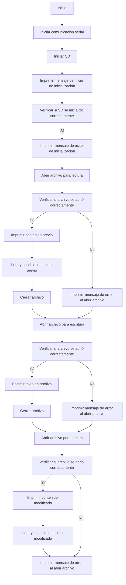
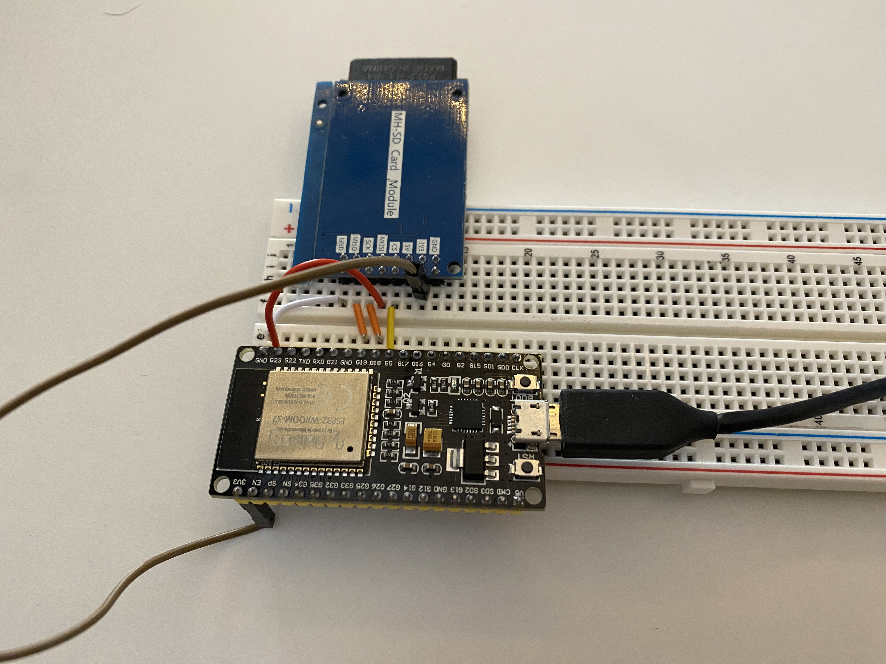
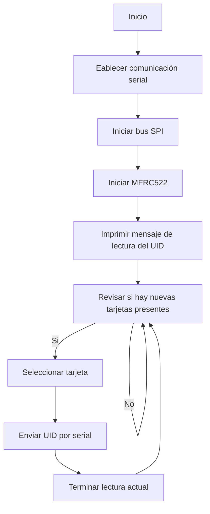
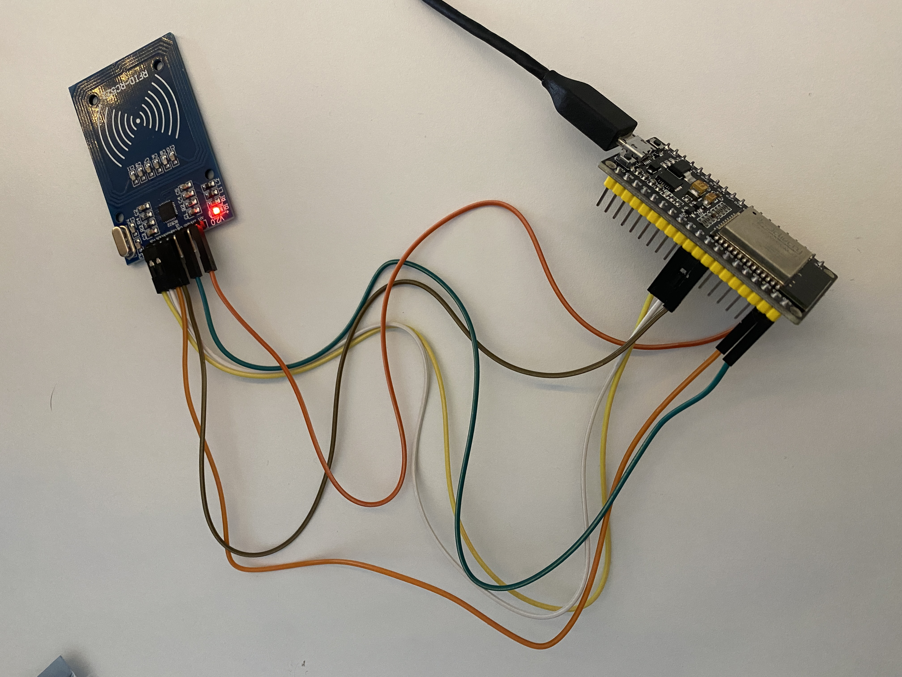

# Practica SPI - Yago Carballo Barroso y Ramon Llobet Duch
En esta práctica trabajaremos con el protrocolo Serial Peripheral Interface (SPI) es un protocolo de comunicación síncrono utilizado para la transferencia de datos. Se compone de un maestro y uno o varios esclavos, donde el maestro controla la transferencia de datos y la sincronización del reloj. El protocolo se caracteriza por su alta velocidad de transmisión de datos, su simplicidad y su flexibilidad, lo que lo hace adecuado para una amplia variedad de aplicaciones, como la comunicación entre microcontroladores y lectores de memorias flash o RFIDs.
***
## Lectura de SD
Este código es un ejemplo de cómo leer y escribir archivos en una tarjeta SD con un ESP32. En la función `void setup()`, se inicializa la comunicación serial y se intenta inicializar la tarjeta SD. Luego, se abre el archivo `/archivo.txt` en modo de lectura, se lee su contenido, se cierra el archivo, se abre en modo de escritura para agregar texto al final del archivo, se escribe una línea de texto y se cierra el archivo. Finalmente, se vuelve a abrir el archivo en modo de lectura, se lee su contenido y se cierra el archivo.

```ino
#include <Arduino.h>
#include <SPI.h>
#include <SD.h>

File myFile;

void setup()
{
  Serial.begin(115200);
  Serial.print("Iniciando SD ...");
  if (!SD.begin(5)) {
    Serial.println("No se pudo inicializar");
    return;
  }
  Serial.println("inicializacion exitosa");
 
// Imprimir contenido previo

  myFile = SD.open("/archivo.txt");//abrimos  el archivo 
  if (myFile) {
    Serial.println("archivo.txt sin modificar:");
    while (myFile.available()) {
    	Serial.write(myFile.read());
    }
    myFile.close(); //cerramos el archivo
  } else {
    Serial.println("Error al abrir el archivo");
  }

// Escribir mas texto

  myFile = SD.open("/archivo.txt", FILE_APPEND); // Abrimos el archivo para escribir, con FILE_APPEND podremos añadir código al ya existente
  // FILE_WRITE sobreescribirá el texto
  
  if (myFile) {
    Serial.println("Escribiendo en el archivo:");
    myFile.println("Hola, este es un texto de prueba de Yago"); // Escribimos una línea de texto en el archivo
    myFile.close(); // Cerramos el archivo
    Serial.println("Escritura finalizada");
  } else {
    Serial.println("Error al abrir el archivo");
  }

// Mostrar de nuevo el contenido

myFile = SD.open("/archivo.txt");//abrimos  el archivo 
  if (myFile) {
    Serial.println("archivo.txt modificado:");
    while (myFile.available()) {
    	Serial.write(myFile.read());
    }
    myFile.close(); //cerramos el archivo
  } else {
    Serial.println("Error al abrir el archivo");
  }

}

void loop()
{
  
}
```

### Platformio.ini
```ini
[env:esp32doit-devkit-v1]
platform = espressif32
board = esp32doit-devkit-v1
framework = arduino
monitor_speed = 115200
monitor_port = /dev/ttyUSB0
```

### Diagrama de flujo

### Montaje


***
## Lectura de códigos por RFID
Este código es un ejemplo de cómo leer códigos de tarjetas RFID con un lector MFRC522 en una placa ESP32. En la función `void setup()`, se inicializa la comunicación serial, el bus SPI y el lector MFRC522. Luego, se imprime un mensaje en el monitor serial indicando que se inició la lectura de la UID de la tarjeta. En la función `void loop()`, se verifica si hay una tarjeta RFID presente y se lee su UID, que se envía a través del monitor serial. Se termina la lectura de la tarjeta y se espera a que se presente una nueva tarjeta.

```ino
#include <Arduino.h>
#include <SPI.h>
#include <MFRC522.h>

#define RST_PIN	9    //Pin 9 para el reset del RC522
#define SS_PIN	5   //Pin 5 para el SS (SDA) del RC522
MFRC522 mfrc522(SS_PIN, RST_PIN); //Creamos el objeto para el RC522

void setup() {
	Serial.begin(115200); //Iniciamos la comunicación  serial
	SPI.begin();        //Iniciamos el Bus SPI
	mfrc522.PCD_Init(); // Iniciamos  el MFRC522
	Serial.println("Lectura del UID");
}

void loop() {
	// Revisamos si hay nuevas tarjetas  presentes
	if ( mfrc522.PICC_IsNewCardPresent()) 
        {  
  		//Seleccionamos una tarjeta
            if ( mfrc522.PICC_ReadCardSerial()) 
            {
                  // Enviamos serialemente su UID
                  Serial.print("Card UID:");
                  for (byte i = 0; i < mfrc522.uid.size; i++) {
                          Serial.print(mfrc522.uid.uidByte[i] < 0x10 ? " 0" : " ");
                          Serial.print(mfrc522.uid.uidByte[i], HEX);   
                  } 
                  Serial.println();
                  // Terminamos la lectura de la tarjeta  actual
                  mfrc522.PICC_HaltA();         
            }      
	}	
}
```
### Platformio.ini
```ini
[env:esp32doit-devkit-v1]
platform = espressif32
board = esp32doit-devkit-v1
framework = arduino
monitor_speed = 115200
monitor_port = /dev/ttyUSB0
lib_deps = miguelbalboa/MFRC522@^1.4.10
```
### Diagrama de flujo


### Montaje

