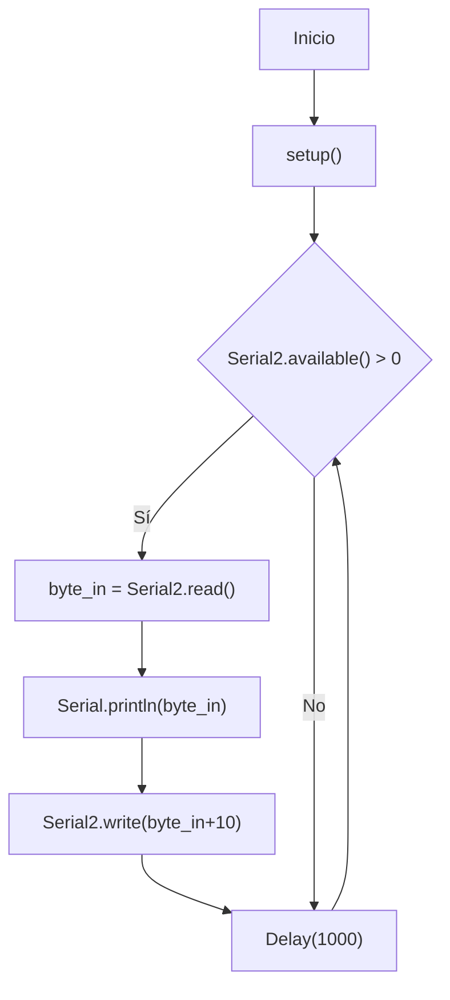
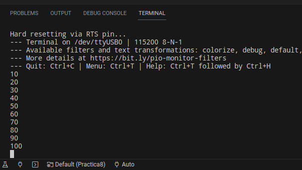

 # Practica 8 - UART
 ## Yago Carballo Barroso y Ramon Llobet Duch
 
El objetivo de esta práctica es entender el funcionamiento del puerto serial controlado por los puertos UART, para ello se establece una comunicación serial bidireccional entre dos dispositivos usando los puertos UART0 y UART2 de Arduino. Recibe un byte a través del UART2, lo imprime en el UART0 y luego envía el byte incrementado en 10 de vuelta a través del UART2. El ciclo se repite continuamente con un retardo de 1 segundo.

**Además habrá que hacer un bucle entre el transmisor (Tx) y el receptor (Rx) del UART2, osea entre los pines 17 y 16.**

### **código**
```ino
#include <Arduino.h>
#include <HardwareSerial.h>


uint8_t byte_in = 1;    // Variable para almacenar el byte recibido

void setup() {

Serial.begin(115200);   // Inicialización de la comunicación serial
Serial2.begin(115200);  // Inicialización de la comunicación serial del UART2
Serial2.write(byte_in); // Envío de un byte por el UART2

}

void loop() {

if (Serial2.available() > 0) {  // Si hay datos disponibles en el UART2

    byte_in = Serial2.read();   // Almacenar el byte recibido en la variable byte_in
    Serial.println(byte_in);    // Imprimir el byte recibido en el UART0
    Serial2.write(byte_in+10);  // Enviar el byte recibido + 10 por el UART2


    delay(1000);               // Retardo de 1 segundo

}
}
```
### **Diagrama de flujo**


### **Salida del código***

