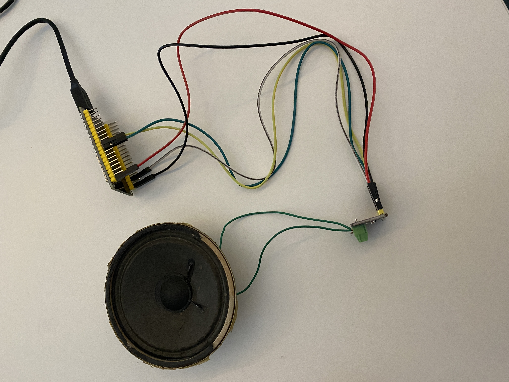
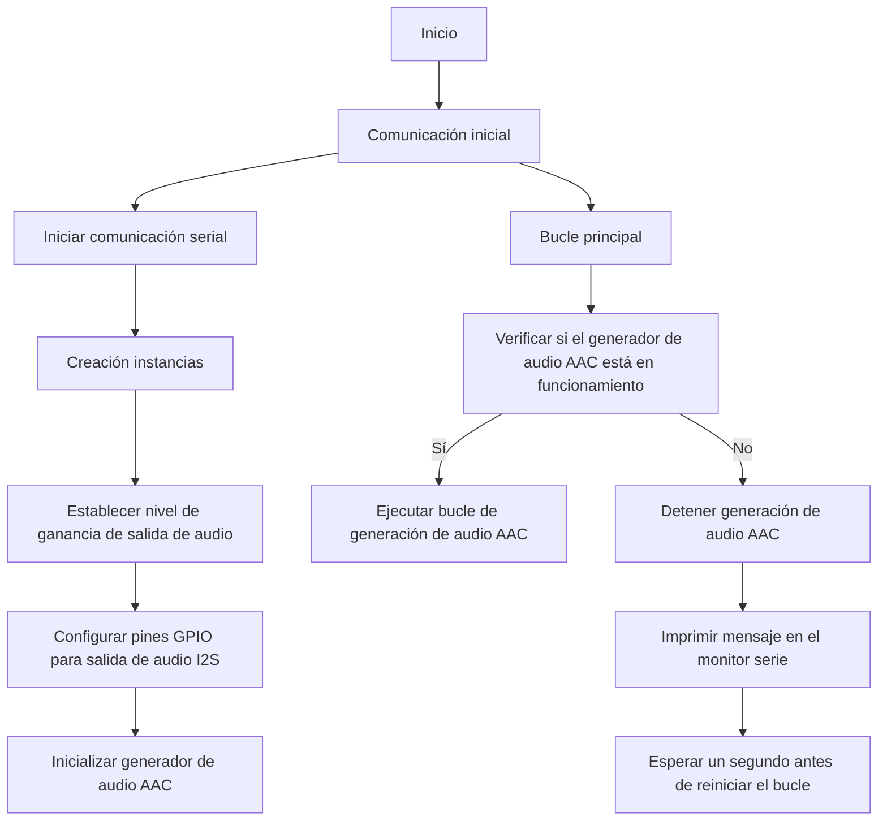
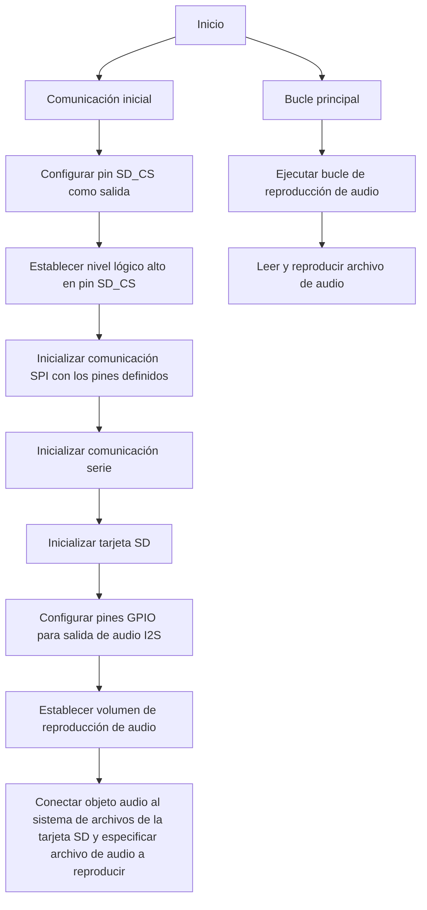

# PRACTICA 7 - I2S  
## Yago Carballo Barroso y Ramon Llobet Duch
En esta práctica vamos a trabajar con el protocolo de comunicación I2S para la ESP32, el cual se usa para transferir señales de sonido digitales.
Así pues, reproduciremos música des de la memoria interna (Archivo aac desde PROGMEM), desde una targeta SD (archivos WAVE y MP3) y retransmitiremos una emisora de radio en directo utilizando conexión WiFi y una tarjeta SD.
***

## Reproducción desde memoria interna (Archivo aac desde PROGMEM)
El siguiente código configura la ESP32 para generar sonido utilizando un archivo de audio en formato AAC. 
El archivo de audio se lee desde la memoria de programa y se envía a la salida de audio utilizando el protocolo I2S. 
El bucle principal del programa verifica si el generador de audio está en funcionamiento y, si es así, genera el audio.
Si el generador de audio se detiene, se muestra un mensaje y se espera un segundo antes de reiniciar el bucle.

La siguiente imagen muestra el cableado entre el ESP32, la placa de conexión de
audio MAX98357 I2S y el altavoz:




```ino
//Bibliotecas
#include<Arduino.h>//biblioteca principal de Arduino para la placa ESP32
#include "AudioGeneratorAAC.h"//biblioteca para generar audio a partir de archivos AAC
#include "AudioOutputI2S.h"//biblioteca para la salida de audio utilizando el protocolo I2S
#include "AudioFileSourcePROGMEM.h"//biblioteca para leer archivos de audio almacenados en la memoria de programa (PROGMEM)
#include "sampleaac.h"

AudioFileSourcePROGMEM *in;//Crea un puntero a un objeto de tipo 
AudioGeneratorAAC *aac;//para generar audio a partir del archivo AAC.
AudioOutputI2S *out;//Crea un puntero a un objeto de tipo AudioOutputI2S para la salida de audio utilizando el protocolo I2S.

void setup(){
  Serial.begin(115200);//Inicializamos la comunicación serie con una velocidad de 115200 baudios para imprimir mensajes en el monitor serie.

  in = new AudioFileSourcePROGMEM(sampleaac, sizeof(sampleaac));
  // Crea una instancia del objeto AudioFileSourcePROGMEM y asigna la dirección y el tamaño del archivo de audio almacenado en la memoria de programa.
  aac = new AudioGeneratorAAC();//Crea una instancia del objeto AudioGeneratorAAC para generar audio a partir del archivo AAC.
  out = new AudioOutputI2S();//Crea una instancia del objeto AudioOutputI2S para la salida de audio utilizando el protocolo I2S.
  out -> SetGain(0.25);//Establece el nivel de ganancia de salida de audio en 0.25 (25%).
  out -> SetPinout(26,25,22);//Configuramos los pines GPIO 26, 25 y 22 para la salida de audio utilizando el protocolo I2S
  aac->begin(in, out);//Inicializa el generador de audio AAC con la fuente de audio y la salida de audio configuradas.
}

void loop(){
  if (aac->isRunning()) {//Verifica si el generador de audio AAC está en funcionamiento.
    aac->loop();//Si el generador de audio está en funcionamiento, se ejecuta el bucle de generación de audio.
  } else {
    aac -> stop();//Detiene la generación de audio AAC
    Serial.printf("Sound Generator\n");//mensaje en el monitor serie indicando que el generador de sonido se ha detenido
    delay(1000);//Espera un segundo antes de reiniciar el bucle
  }
}
```


### Diagrama de flujo



###  Reproducción de un archivo WAVE en ESP32 desde una tarjeta SD externa

El siguiente código configura la ESP32 para reproducir un archivo de audio en formato WAVE almacenado en una tarjeta SD. Se utilizan los pines GPIO especificados para la comunicación con la tarjeta SD y la salida de audio mediante el protocolo I2S. El bucle principal del programa se encarga de reproducir continuamente el archivo de audio especificado.

```ino
//Bbibliotecas:
#include<Arduino.h>
#include "Audio.h"
#include "SD.h"//biblioteca para acceder a la tarjeta SD.
#include "FS.h"//biblioteca para acceder al sistema de archivos.

//Definición de Pines
// Digital I/O used
#define SD_CS         19//5
#define SPI_MOSI      23
#define SPI_MISO      5//19
#define SPI_SCK       18
#define I2S_DOUT      25
#define I2S_BCLK      27
#define I2S_LRC       26

Audio audio;// Crea un objeto de tipo Audio para reproducir audio en la ESP32

void setup(){
    pinMode(SD_CS, OUTPUT);//Configura el pin SD_CS como salida.
    digitalWrite(SD_CS, HIGH);// Establece el nivel lógico alto en el pin SD_CS, desactivando la tarjeta SD.
    SPI.begin(SPI_SCK, SPI_MISO, SPI_MOSI);// Inicializa la comunicación SPI con los pines definidos
    Serial.begin(115200);
    SD.begin(SD_CS);//Inicializa la tarjeta SD
    audio.setPinout(I2S_BCLK, I2S_LRC, I2S_DOUT);//Configura los pines GPIO para la salida de audio utilizando el protocolo I2S.
    audio.setVolume(16); // 0...21//Establece el volumen de reproducción del audio en 12 (rango de 0 a 21).
    audio.connecttoFS(SD, "001.wav");//Conecta el objeto audio al sistema de archivos de la tarjeta SD y especifica el nombre del archivo de audio a reproducir.
    //Si quisiéramos reproducir un archivo MP3 seria de la siguinete forma: audio.connecttoFS(SD, "002.mp3");
}

void loop(){
    audio.loop();//Llama al bucle de reproducción de audio. Esta función se encarga de leer y reproducir el archivo de audio.
}

```


### Diagrama de flujo



### Reproducción de audio utilizando conexión WiFi y una tarjeta SD (retransmisión en directo de una radio).

El siguiente código configura la ESP32 para reproducir audio utilizando una conexión WiFi y una tarjeta SD. Se establece la conexión WiFi utilizando las credenciales proporcionadas y se conecta el objeto audio a un flujo de audio en línea mediante una URL específica. El bucle principal del programa se encarga de reproducir continuamente el flujo de audio y permite cambiar la URL de reproducción a través del puerto serie.


```ino

//Bibliotecas:
#include "Arduino.h"
#include "WiFiMulti.h"//biblioteca para la gestión de conexiones WiFi múltiples.
#include "Audio.h"
#include "SPI.h"
#include "SD.h"
#include "FS.h"

//Definición de pines:
// Digital I/O used
#define SD_CS          5
#define SPI_MOSI      23
#define SPI_MISO      19
#define SPI_SCK       18
#define I2S_DOUT      25
#define I2S_BCLK      27
#define I2S_LRC       26

//Declaración de objetos:
Audio audio;
WiFiMulti wifiMulti;// Crea un objeto de tipo WiFiMulti para gestionar múltiples conexiones WiFi
String ssid =     "MOVISTAR_D84E";
String password = ";9o2a3ei5RY#!:";


void setup() {
    pinMode(SD_CS, OUTPUT);//: Configura el pin SD_CS como salida.
    digitalWrite(SD_CS, HIGH);//Establece el nivel lógico alto en el pin SD_CS, desactivando la tarjeta SD.
    SPI.begin(SPI_SCK, SPI_MISO, SPI_MOSI);//Inicializa la comunicación SPI con los pines
    SPI.setFrequency(1000000);//Establece la frecuencia de la comunicación SPI a 1 MHz.
    Serial.begin(115200);
    SD.begin(SD_CS);
    WiFi.mode(WIFI_STA);//Configura el modo de la conexión WiFi como estación (cliente).
    wifiMulti.addAP(ssid.c_str(), password.c_str());//Agrega una red WiFi a la lista de conexiones múltiples con el SSID y la contraseña especificados.
    wifiMulti.run();//Inicia la conexión WiFi utilizando las credenciales proporcionadas.
    if(WiFi.status() != WL_CONNECTED){//Verifica si la conexión WiFi se estableció correctamente o no.
        WiFi.disconnect(true);
        wifiMulti.run();
    }
    audio.setPinout(I2S_BCLK, I2S_LRC, I2S_DOUT);
    audio.setVolume(12);//Establece el volumen de reproducción del audio en 12 (rango de 0 a 21).

//    audio.connecttohost("http://www.wdr.de/wdrlive/media/einslive.m3u");
//    audio.connecttohost("http://somafm.com/wma128/missioncontrol.asx"); //  asx
//    audio.connecttohost("http://mp3.ffh.de/radioffh/hqlivestream.aac"); //  128k aac
//    audio.connecttohost("http://mp3.ffh.de/radioffh/hqlivestream.mp3"); //  128k mp3
      audio.connecttohost("http://nodo01-cloud01.streaming-pro.com:8000/flaixfm.mp3");//Conecta el objeto audio a un flujo de audio en línea utilizando la URL proporcionada.
}

void loop()
{
    audio.loop();
    if(Serial.available()){ // put streamURL in serial monitor
        audio.stopSong();//Detiene la reproducción actual si se reciben nuevos datos en el puerto serie.
        String r=Serial.readString(); r.trim();//Lee la cadena de caracteres recibida en el puerto serie y elimina los espacios en blanco.
        if(r.length()>5) audio.connecttohost(r.c_str());
        //Verifica si la cadena de caracteres recibida tiene una longitud mayor a 5 y, en ese caso, conecta el objeto audio a un nuevo flujo de audio en línea utilizando la URL proporcionada.
        log_i("free heap=%i", ESP.getFreeHeap());// Imprime en el monitor serie la cantidad de memoria libre disponible.
    }
}

```


### Diagrama de flujo
```mermaid
flowchart TD;
   A[Inicio] --> B[Comunicación inicial];
    B --> C[Configurar pin SD_CS como salida];
    C --> D[Establecer nivel lógico alto en pin SD_CS, desactivando la tarjeta SD];
    D --> E[Inicializar comunicación SPI con los pines definidos];
    E --> F[Establecer frecuencia de comunicación SPI a 1 MHz];
    F --> G[Inicializar comunicación serie];
    G --> H[Inicializar tarjeta SD];
    H --> I[Configurar modo de conexión WiFi como estación (cliente)];
    I --> J[Agregar red WiFi a la lista de conexiones múltiples con SSID y contraseña especificados];
    J --> K[Iniciar conexión WiFi utilizando las credenciales proporcionadas];
    K --> L[Verificar si la conexión WiFi se estableció correctamente];
    L --> M[Desconectar WiFi y volver a ejecutar la conexión WiFi si no se estableció correctamente];

    A --> N[Bucle principal];
    N --> O[Ejecutar bucle de reproducción de audio];
    O --> P[Verificar si hay datos disponibles en el puerto serie];
    P --> Q[Detener reproducción actual si se reciben nuevos datos en el puerto serie];
    Q --> R[Leer cadena de caracteres recibida en el puerto serie y eliminar espacios en blanco];
    R --> S[Verificar si la cadena de caracteres recibida tiene una longitud mayor a 5];
    S --> T[Conectar objeto audio a un nuevo flujo de audio en línea utilizando la URL proporcionada];
    
    ```
  


